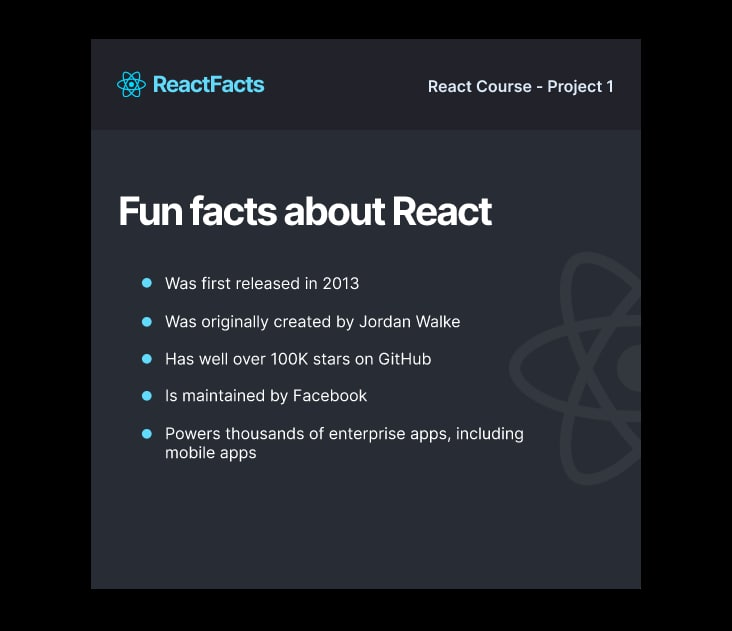
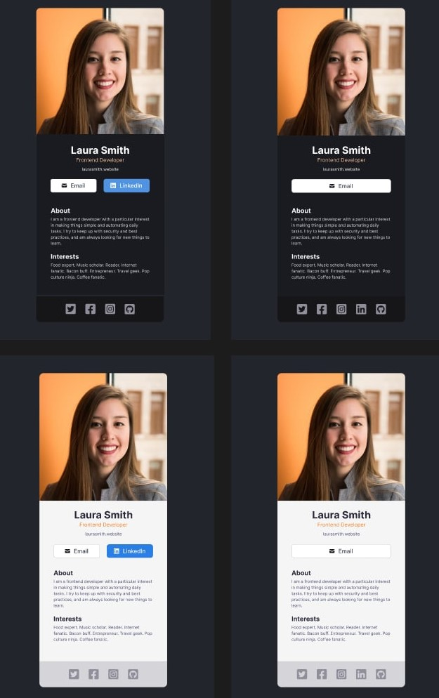
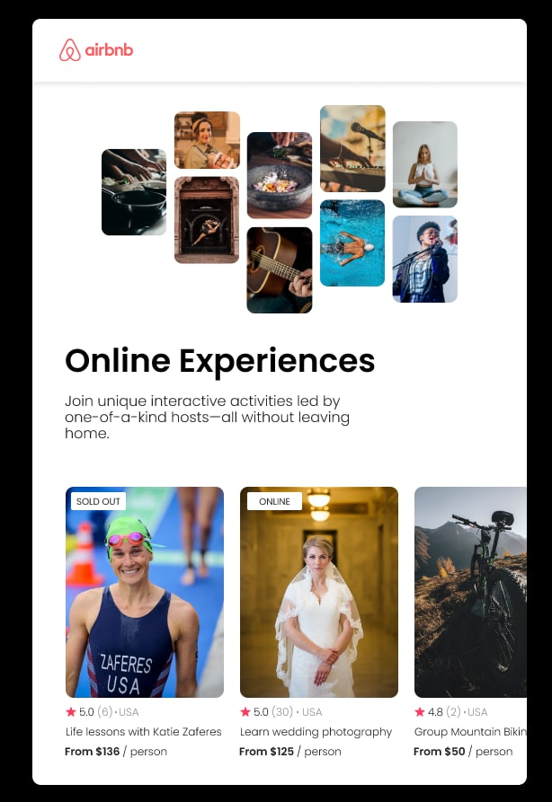

# React-js-learn

##  1. My-app (1st learning project)
   Challenge: Starting from scratch, build and render the 
HTML for our section project. Check the Google slide for 
what you're trying to build. We'll be adding styling to it later.

##  2. My-react-app (2nd learning project)
   A simple react profile card project challenge from scrimba learn react course

##      3. Air-Bnb (3rd learning project)

    A mostly reasonable approach to React and JSX.
This style guide is mostly based on the standards that are currently prevalent in JavaScript, although some conventions (i.e async/await or static class fields) may still be included or prohibited on a case-by-case basis. Currently, anything prior to stage 3 is not included nor recommended in this guide.

